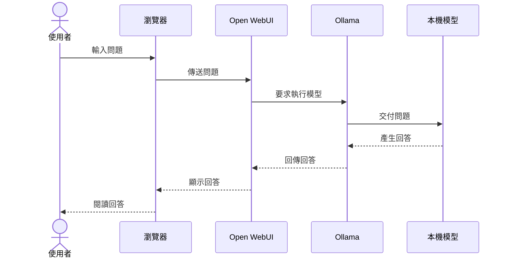

# 單元 01 地端 AI 與本機模型基本觀念

## 1 教學目標

- 學生能說明地端 AI 與雲端 AI 的基本差異
- 學生能辨認 Docker Desktop、Docker Compose、Ollama、Open WebUI 與本機模型的角色
- 學生能說明問題如何送到本機模型並取得回答

## 2 必要觀念

### 什麼是地端 AI

地端 AI 是在個人或組織自行擁有、管理或控制的運算設備上執行模型，而非將內容交由外部雲端模型服務處理

本課程以個人電腦進行實作，安裝與模型下載完成後，多數基本功能可以在沒有網路的情況下使用，輸入內容與文件原則上保留於該地端環境

### 地端 AI 與雲端 AI 的差異

| 比較項目 | 地端 AI | 雲端 AI |
| --- | --- | --- |
| 執行位置 | 個人或組織自行掌控的運算設備 | 外部服務提供者的伺服器 |
| 網路範圍 | 可限制為單機或指定內網，並禁止連接外網 | 通常需要連接外部服務 |
| 資料範圍 | 保留在個人或組織自行管理的環境 | 內容需要傳送至外部服務 |
| 執行速度 | 受地端設備硬體影響 | 由服務提供者的硬體決定 |
| 模型能力 | 受地端設備資源限制 | 通常可使用較大型模型 |
| 維護責任 | 個人或組織自行管理 | 主要由服務提供者管理 |

### 本課程使用的元件

```text
Windows 11
└─ Docker Desktop + WSL2
   └─ Docker Compose
      ├─ Ollama
      │  └─ 本機模型
      └─ Open WebUI
         └─ 操作介面
```

| 元件 | 角色 |
| --- | --- |
| Windows 11 | 提供電腦操作環境 |
| Docker Desktop + WSL2 | 提供容器執行環境 |
| Docker Compose | 統一啟動與停止服務 |
| Ollama | 管理並執行本機模型 |
| 本機模型 | 接收問題並產生回答 |
| Open WebUI | 提供模型選擇與聊天操作畫面 |

### 提問與回答的基本流程



使用者操作 Open WebUI，Ollama 在後端執行模型，模型完成處理後再沿原路回傳回答

## 3 教師示範

1. 使用架構圖指出 Windows 11、Docker Desktop、Docker Compose、Ollama、Open WebUI 與本機模型
2. 從使用者輸入問題開始，依序說明問題傳送與回答回傳的方向
3. 說明地端 AI 可以執行於個人電腦或組織自行管理的內部設備
4. 比較地端 AI 與外部雲端服務的資料流向
5. 說明使用瀏覽器操作不代表模型一定執行於雲端

## 4 成功檢查

學生能用自己的話完成下列說明

- 地端 AI 不只限於個人電腦，也可以執行於組織自行管理的內部設備
- Open WebUI 提供操作畫面
- Ollama 負責執行本機模型
- 使用瀏覽器不代表模型一定執行於雲端
- 地端環境可以限制為單機或指定內網並禁止連接外網

## 5 常見問題與排除

### 地端 AI 只能供一個人使用嗎

不是，地端 AI 可以只供個人使用，也可以部署於組織自行管理的伺服器並提供指定內網使用

### 地端 AI 一定要完全斷網嗎

不一定，可以允許內網連線並禁止連接外網，也可以依需求完全離線

### 使用瀏覽器就是使用雲端 AI 嗎

不是，瀏覽器只是操作介面，模型可能執行於同一部電腦、內部伺服器或外部雲端

### 沒有獨立 GPU 還能使用嗎

可以，系統可以使用 CPU 執行，但回答速度通常較慢

### 使用地端 AI 就能保證資料不會送出嗎

不一定，仍需確認系統是否另外連接外部服務，本課程實作不連接外部模型服務

## 6 單元成果

- 學生能說明地端 AI 的管理範圍與基本對話流程
