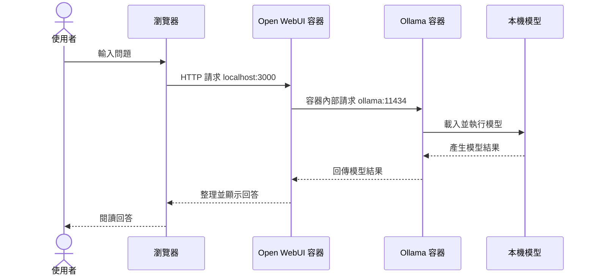

# 單元 03 啟動 Ollama 與 Open WebUI

## 1 教學目標

- 學生能使用 Docker Compose 啟動 Ollama 與 Open WebUI
- 學生能開啟本機 Web 介面並建立第一個管理帳號
- 學生能檢視服務狀態並安全停止服務

## 2 必要觀念

本單元會啟動兩個容器

| 容器 | 角色 |
| --- | --- |
| Ollama | 管理並執行後續選擇的本機模型 |
| Open WebUI | 提供聊天、模型選擇與知識庫操作畫面 |

### 容器與設定檔

兩個容器的名稱、連線方式、資料儲存位置與啟動條件都記錄在 `03_compose.yaml`
Docker Compose 會讀取這份設定檔並統一管理 Ollama 與 Open WebUI

> 本單元尚未指定或下載對話模型

### 服務控制選單

本課程提供的服務控制程式為 `03_service-control.cmd`
開啟腳本後即可從選單啟動服務、檢視狀態或停止服務
為了讓執行結果更容易辨認，控制選單使用顏色區分功能與狀態

- 綠色表示啟動或執行成功
- 青色表示狀態與一般資訊
- 黃色表示停止操作或注意事項
- 紅色表示錯誤

### 提問與回答流程



使用者只需要操作瀏覽器並開啟 [http://localhost:3000](http://localhost:3000)

> Open WebUI 負責接收問題與顯示回答，Ollama 在後端負責執行本機模型

> Open WebUI 只綁定本機位址 `127.0.0.1`，**同網路中的其他電腦無法直接連入**

容器資料儲存在 Docker named volumes，停止或更新容器不會自動刪除聊天、模型與設定

## 3 要點

- 說明 `03_compose.yaml` 記錄服務設定，`03_service-control.cmd` 提供操作選單
- 利用流程圖說明 Open WebUI 接收操作，Ollama 負責執行模型
- 引導學生分辨啟動服務、開啟瀏覽器與建立帳號三個不同動作
- 說明關閉瀏覽器或控制視窗後，容器服務仍可能在背景執行
- 示範停止再啟動服務後，如何確認帳號與資料仍被保留
- 提醒第一個 Open WebUI 帳號具有管理權限，應妥善保管登入資料

## 4 實作

### 步驟一 確認檔案

教材資料夾中應包含

```text
03-啟動-Ollama-與-Open-WebUI/
├─ README.md
├─ 03_compose.yaml
└─ 03_service-control.cmd
```

### 步驟二 啟動服務

1. 先啟動 Docker Desktop
2. 等待畫面顯示 Engine running
3. 接著在 `03_service-control.cmd` 上按兩下
4. 輸入 `1` 並按 Enter

第一次執行時系統會下載

- Ollama container image
- Open WebUI container image

下載完成且服務啟動後，腳本會自動使用預設瀏覽器開啟 [http://localhost:3000](http://localhost:3000)

> 若瀏覽器沒有自動開啟，請自行開啟瀏覽器並輸入上述網址

> 若太早開啟瀏覽器且顯示無法連線，等待約一分鐘後重新整理

### 步驟三 建立 Open WebUI 帳號

1. 輸入本機使用的電子郵件格式帳號
2. 設定密碼
3. 完成登入

> **第一個建立的帳號會成為此 Open WebUI 的管理者，自行保管**

> 帳號只存在本機環境，不會自動建立外部雲端帳號

### 步驟四 檢視服務狀態

1. 開啟 `03_service-control.cmd`
2. 輸入 `2` 並按 Enter

正常狀態應看到

| Compose 服務 | 預期狀態 |
| --- | --- |
| ollama | Up |
| open-webui | Up |

也可以在 CMD 或 PowerShell 執行

```console
docker compose -f 03_compose.yaml ps
```

執行指令前需先進入包含 `03_compose.yaml` 的教材資料夾

### 步驟五 停止服務

1. 先關閉進行中的模型回答
2. 接著開啟 `03_service-control.cmd`
3. 輸入 `3` 並按 Enter
4. 停止服務後

- 容器停止占用運算資源
- 聊天與設定仍然保留
- 已下載模型仍然保留
- 下次可在 `03_service-control.cmd` 選擇 `1` 再次啟動

### 步驟六 再次啟動

1. 啟動 Docker Desktop 並等待 Engine running
2. 開啟 `03_service-control.cmd`
3. 輸入 `1` 並按 Enter
4. 開啟 [http://localhost:3000](http://localhost:3000)
5. 使用剛才建立的帳號登入
6. 確認帳號仍然存在

## 5 成功檢查

完成本單元時應符合

- Docker Desktop 顯示 Engine running
- `ollama` 服務狀態為 Up
- `open-webui` 服務狀態為 Up
- [http://localhost:3000](http://localhost:3000) 可以開啟
- 學生可以登入自己的 Open WebUI 帳號
- 停止再啟動後帳號資料仍然存在

## 6 常見問題與排除

### 顯示找不到 docker 指令

確認 Docker Desktop 已安裝，重新開啟 CMD 或 PowerShell 後再試一次

### 顯示 Docker Engine 尚未執行

開啟 Docker Desktop，等待 Engine running 後在 `03_service-control.cmd` 再次選擇 `1`

### 第一次啟動下載很久

確認網路連線正常，第一次需要下載兩個容器映像，後續啟動不會重複完整下載

### 連接埠 3000 已被使用

先關閉可能使用 3000 連接埠的其他服務，若無法確認原因，由教師協助修改 `03_compose.yaml` 中的本機連接埠

### Open WebUI 顯示無法連接模型服務

在 `03_service-control.cmd` 選擇 `2` 並確認 Ollama 狀態為 Up，若 Ollama 未啟動，可執行

```console
docker compose -f 03_compose.yaml restart ollama
```

### 忘記本機帳號密碼

若不需要保留原有帳號、對話、設定與知識庫，可以重新建立 Open WebUI

> 下列操作會永久刪除 Open WebUI 的既有資料，但會保留 Ollama 中已下載的模型

1. 關閉 Open WebUI 頁面
2. 在本單元資料夾空白處按滑鼠右鍵
3. 選擇「在終端機中開啟」
4. 依序執行下列指令

```console
docker compose -f 03_compose.yaml down
docker volume rm local-ai_open-webui-data
docker compose -f 03_compose.yaml up -d
```

5. 開啟 [http://localhost:3000](http://localhost:3000)
6. 重新建立第一個 Open WebUI 帳號

這組指令會移除舊容器、專案網路與 Open WebUI 資料卷，再建立乾淨的 Open WebUI，不會留下舊帳號資料

### 關閉腳本控制視窗後服務仍然執行

這是正常情況，容器在背景執行，必須在 `03_service-control.cmd` 選擇 `3` 才會停止

## 7 單元成果

- 學生成功啟動 Ollama 與 Open WebUI
- 學生建立本機帳號並能重新登入
- 學生能使用腳本檢視狀態、停止及再次啟動服務

## 官方參考資料

- [Open WebUI 官方 Docker Compose](https://github.com/open-webui/open-webui/blob/main/docker-compose.yaml)
- [Open WebUI Quick Start](https://docs.openwebui.com/getting-started/quick-start/)
- [Ollama Docker](https://docs.ollama.com/docker)
