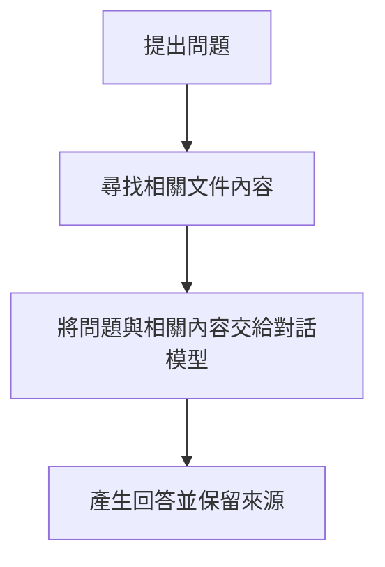
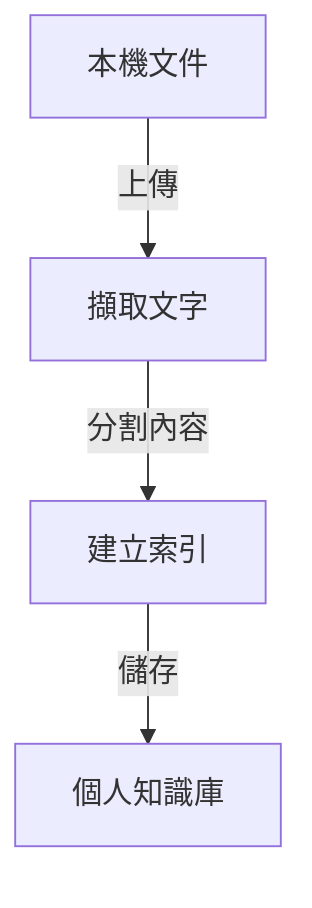

# 單元 05 建立個人知識庫

## 1 教學目標

- 學生能準備適合首次實作的本機文件
- 學生能建立知識庫並上傳多份文件
- 學生能確認文件已完成文字擷取與索引
- 學生能分辨集中管理的知識庫與單次對話附件

## 2 必要觀念

### 什麼是 RAG

RAG 是 Retrieval-Augmented Generation 的縮寫，中文常譯為「檢索增強生成」

這個名稱描述的是三個連續動作，不是三個需要分別安裝的元件

- 檢索：系統從知識庫索引找出與問題相關的文件內容
- 增強 / 補充：系統將找到的補充內容與問題組合，提供給對話模型
- 生成：對話模型根據這份輸入內容產生回答

> RAG 不會把所有文件內容直接寫入對話模型，而是在每次提問時搜尋相關內容，因此能利用個人資料回答問題並保留來源



本單元先完成知識庫與文件索引，第 06 單元再進行文件問答與引用查核

### 知識庫與對話附件

| 使用方式 | 適合情況 | 文件是否方便重複使用 |
| --- | --- | --- |
| 知識庫 | 同一主題的多份文件、後續會持續查詢或更新 | 是 |
| 對話附件 | 臨時閱讀單一文件、只在目前對話使用 | 否 |

本單元使用知識庫集中儲存同一主題的文件，第 06 單元再使用這些文件進行問答與引用查核

### 文件如何成為可檢索資料


建立索引後，系統可依問題找出相關內容，不需要每次把所有文件全文交給對話模型

完整流程請參閱 [補充教材-本次實作架構演進](補充教材-本次實作架構演進.md)

### 對話模型與索引模型

| 模型 | 用途 |
| --- | --- |
| `gemma3:4b` | 理解問題並產生回答 |
| `embeddinggemma:300m-qat-q4_0` | 建立文件索引並尋找相關內容 |

> `embeddinggemma:300m-qat-q4_0` 約為 239 MB，第一次下載需要網路，下載完成後可在本機離線使用

### 兩種文件使用模式

| 模式 | 運作方式 | 適合情況 |
| --- | --- | --- |
| Focused Retrieval | 只取出與問題相關的內容 | 多份文件、較長文件、一般知識庫問答 |
| Full Context | 每次將整份文件內容交給模型 | 內容很短且必須完整閱讀的文件 |

本課程建立知識庫時先使用預設的 Focused Retrieval，Full Context 會在第 06 單元進行比較

Knowledge、RAG、File Context 與工具呼叫的關係，請參閱 [補充教材-Knowledge、RAG 與文件使用模式](補充教材-Knowledge、RAG-與文件使用模式.md)

## 3 要點

- RAG 會先尋找相關文件內容，再交由對話模型產生回答
- 知識庫適合重複使用同一組文件，對話附件適合單次使用
- 文件上傳後，還要經過文字擷取、內容分割與建立索引
- 對話模型與索引模型負責不同工作，索引模型不供一般對話選用
- 上傳完成與索引完成是不同狀態
- 文件品質、主題範圍與檔名會影響後續查詢與來源辨識

## 4 實作

### 步驟一 準備文件

1. 在本機建立一個本次實作專用資料夾
2. 選擇一個明確主題，例如課程筆記、研究資料或設備手冊
3. 放入兩至五份可信且來源已知的文件
4. 確認檔名能辨識內容與版本

> 第一次實作應優先選擇純文字且可反白複製的文件，掃描圖片、複雜表格與特殊版面可能無法完整擷取

### 步驟二 啟動服務

1. 啟動 Docker Desktop 並等待 Engine running
2. 在 `03_service-control.cmd` 上按兩下
3. 選擇 `1 Start Ollama and Open WebUI`
4. 等待瀏覽器開啟 Open WebUI
5. 登入自己的本機帳號

### 步驟三 下載索引模型

1. 開啟 "設定" > "模型" > "動作" > "管理" > "從 Ollama 下載模型"
2. 輸入 `embeddinggemma:300m-qat-q4_0`
3. 開始下載並等待完成
4. 至模型選單，點筆開選單並選擇 **隱藏模型**

> 此模型只用於文件索引，設為 隱藏模型 後不會出現在新對話的模型選單中，但仍可供 RAG 使用

> 選擇 Disable 或 Delete 可能使文件索引無法使用

### 步驟四 確認文件索引設定

1. 開啟管理員設定中的 "文件"
2. 確認 "嵌入模型引擎" 為 `Ollama`
3. 確認 "嵌入模型" 為 `embeddinggemma:300m-qat-q4_0`
4. 若修改了設定，儲存後再開始上傳文件

文件建立索引後不要任意更換索引模型，更換後必須重新建立既有文件的索引

### 步驟五 建立知識庫

1. 從側邊欄開啟 "工作區"
2. 選擇 "知識庫"
3. 選擇 "建立"
4. 輸入容易辨識的知識庫名稱
5. 在說明欄填寫主題、資料範圍與用途
6. 完成建立並進入知識庫

名稱範例

```text
課程名稱－單元主題－2026
```

說明範例

```text
收錄本學期指定教材與個人筆記，用於內容查詢、摘要與跨文件比較
```

### 步驟六 上傳並建立索引

1. 在知識庫中選擇新增內容或上傳文件
2. 選取 **步驟一** 準備的兩至五份文件
3. 等待每份文件完成上傳與處理
4. 確認畫面沒有顯示失敗或錯誤
5. 重新整理頁面並確認文件仍在知識庫中

> 上傳完成不一定代表索引已完成，文件仍在處理時不要立即進行問答

## 5 成功檢查

完成本單元時應符合

- `embeddinggemma:300m-qat-q4_0` 已完成下載
- `embeddinggemma:300m-qat-q4_0` 已設為 Hide 且不會出現在新對話的模型選單中
- "嵌入模型引擎" 為 Ollama
- 已建立一個主題明確的知識庫
- 知識庫中包含兩至五份本機文件
- 每份文件都已完成處理且沒有錯誤
- 關閉並重新開啟頁面後仍能看到知識庫與文件

## 6 常見問題與排除

### 找不到 "工作區" 或 "知識庫"

確認已登入 Open WebUI，若側邊欄收合，先展開側邊欄再尋找 "工作區"

### 索引模型下載失敗

確認電腦可以連接網路、Ollama 服務狀態為 Up 且磁碟仍有足夠空間，再重新下載

### 文件一直顯示處理中

先等待數分鐘並重新整理頁面，若仍未完成，檢查 Ollama 與 Open WebUI 的服務狀態後重新上傳該文件

### 文件處理失敗

先以 TXT、MD 或文字可反白複製的 PDF 測試，若測試文件成功，原文件可能包含掃描圖片、加密、損壞或無法辨識的版面

### 已修改索引模型

進入管理員設定中的 "文件"，確認目前模型後執行 "重新建立索引（Reindex）"，讓知識庫內的既有文件使用相同模型重新建立索引

### 同一份文件出現多次

保留需要的版本並刪除重複項目，重新上傳更新版本前應先確認檔名與內容是否容易區分

## 7 單元成果

學生完成一個包含多份本機文件的個人知識庫，文件已建立索引並可供下一單元進行問答與引用查核

## 官方參考資料

- [Microsoft Retrieval Augmented Generation](https://learn.microsoft.com/en-us/azure/foundry/concepts/retrieval-augmented-generation)
- [Open WebUI Knowledge](https://docs.openwebui.com/features/workspace/knowledge/)
- [Open WebUI RAG](https://docs.openwebui.com/features/chat-conversations/rag/)
- [Ollama Embeddings](https://docs.ollama.com/capabilities/embeddings)
- [Ollama EmbeddingGemma](https://ollama.com/library/embeddinggemma/tags)

## 單元導引

- 上一單元：[單元 04 本機模型對話實作](../04-本機模型對話實作/README.md)
- 下一單元：[單元 06 文件問答與引用查核](../06-文件問答與引用查核/README.md)
