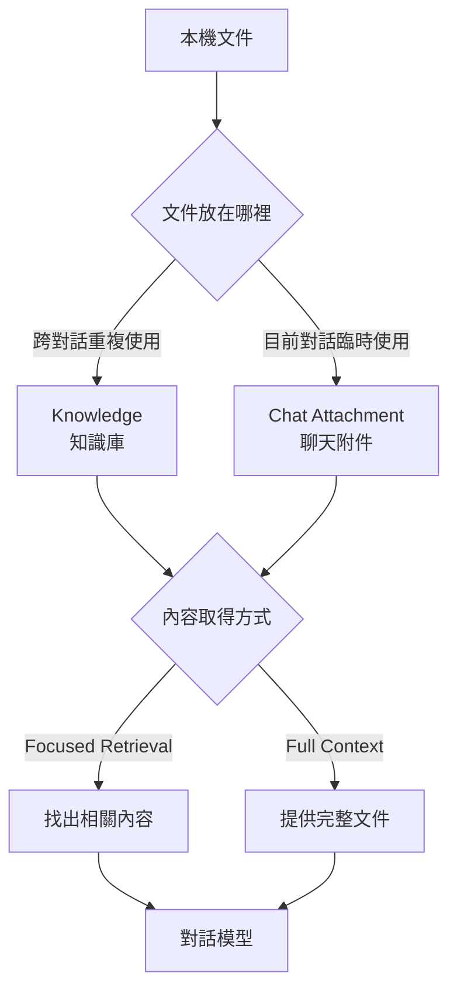
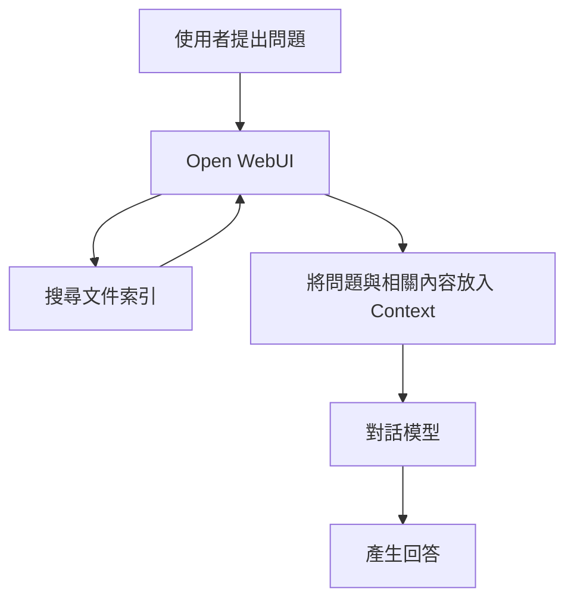
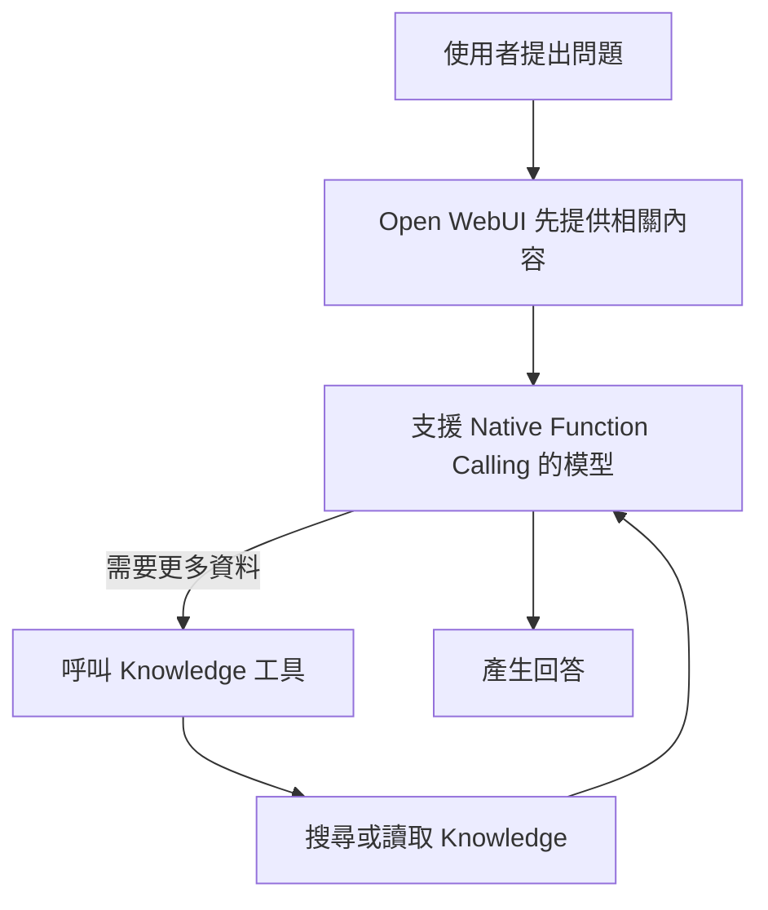
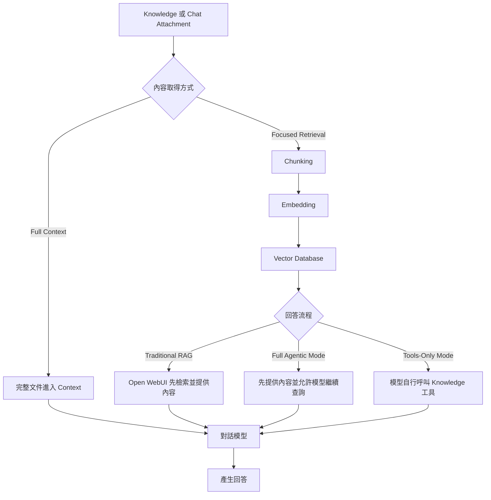

# 補充教材：Knowledge、RAG 與文件使用模式

**Open WebUI 中的 Knowledge、RAG、File Context 與工具呼叫差異？**

最簡單的理解方式是：

> Knowledge（知識庫）負責管理文件，RAG（檢索增強生成）負責先找資料再回答，File Context（檔案內容）與 Builtin Tools（內建工具）則會影響模型取得文件內容的方式

## 先分清楚名詞

| 層級 | 原文名稱 | 在 Open WebUI 中的作用 |
| --- | --- | --- |
| 文件管理 | Knowledge（知識庫） | 管理可跨對話重複使用的文件集合 |
| 回答方法 | RAG（檢索增強生成） | 先找出相關資料，再交給模型產生回答 |
| 內容取得方式 | Focused Retrieval（聚焦檢索） | 從文件中找出與問題相關的內容 |
| 內容取得方式 | Full Context（完整內容） | 將完整文件內容提供給模型 |
| Open WebUI 能力 | File Context（檔案內容） | 處理附加文件並將取得的內容放入 Context（上下文） |
| Open WebUI 能力 | Builtin Tools（內建工具） | 將 Knowledge 與檔案查詢工具提供給模型 |
| 模型能力 | Native Function Calling（原生函式呼叫） | 讓模型以結構化方式自行呼叫工具 |
| 索引技術 | Embedding（嵌入） | 將文字轉換成可供相似度比較的資料 |
| 索引技術 | Vector Database（向量資料庫） | 儲存並搜尋文件的 Embedding |

**Knowledge 不等於 RAG**

同一個 Knowledge 可以使用 Focused Retrieval，也可以切換為 Full Context；在模型支援工具呼叫時，也可以供 Agentic RAG（代理式 RAG）使用

## Knowledge 與聊天附件

兩者都能提供文件內容，但管理範圍不同

| 使用方式 | 適合情況 | 是否方便跨對話使用 |
| --- | --- | --- |
| Knowledge（知識庫） | 同一主題的多份文件，後續會持續查詢或更新 | 是 |
| Chat Attachment（聊天附件） | 只在目前對話中臨時使用的文件 | 否 |



> 聊天附件不是固定將整份文件直接交給模型

使用 Focused Retrieval 時，聊天附件也可以經過擷取、分段、Embedding 與檢索；只有使用 Full Context 時，系統才會將完整文件內容放入每次對話的 Context

## 文件如何成為可檢索資料

使用 Focused Retrieval 時，文件通常會經過以下流程：

```text
文件
↓
文字擷取
↓
Chunking（內容分段）
↓
Embedding（嵌入）
↓
Vector Database（向量資料庫）
```

- 每個 Chunk（內容片段）都會建立 Embedding，系統收到問題後，再找出較相關的內容片段
- Vector Database 是檢索索引的實作方式之一，不等於 Knowledge，也不負責產生回答
- 使用 Full Context 時，不會先以相似度挑選部分 Chunk，而是將完整文件內容放入 Context，因此較適合短文件

## Traditional RAG

Traditional RAG（傳統 RAG）由 Open WebUI 先處理檢索，再將找到的內容提供給模型



這個流程的重點是：

- Open WebUI 負責搜尋相關內容
- 模型收到問題時，相關內容已在 Context 中
- 模型不必自行決定是否呼叫 Knowledge 工具
- 模型不一定需要支援 Native Function Calling

## Full Agentic Mode

Full Agentic Mode（完整代理模式）同時提供預先取得的 RAG 內容與 Builtin Tools



模型可以先閱讀已提供的內容，再依需要繼續搜尋、讀取其他文件或進行多次查詢

這個模式需要模型能可靠使用 Native Function Calling，不是只在畫面中啟用 Builtin Tools 就一定能成功

## Tools-Only Mode

Tools-Only Mode（僅工具模式）不預先將檢索內容放入 Context，而是由模型自行判斷是否呼叫工具

```text
問題
↓
模型判斷是否需要資料
↓
呼叫 Knowledge 工具
↓
Open WebUI 搜尋或讀取文件
↓
結果交回模型
↓
模型產生回答
```

如果模型沒有呼叫工具，就不會取得文件內容，因此這個模式不適合不支援工具呼叫，或工具呼叫表現不穩定的模型

## File Context 與 Builtin Tools 的組合

下表主要說明附加在目前對話中的文件或 Knowledge：

| File Context | Builtin Tools | 使用結果 | 是否需要模型支援工具呼叫 |
| --- | --- | --- | --- |
| 開啟 | 關閉 | Traditional RAG：Open WebUI 先檢索並提供內容 | 否 |
| 開啟 | 開啟 | Full Agentic Mode：先提供內容，模型也能繼續查詢 | 是 |
| 關閉 | 開啟 | Tools-Only Mode：只由模型按需要查詢 | 是 |
| 關閉 | 關閉 | No File Processing（不處理檔案）：模型無法取得附件內容 | 否，但無法使用文件 |

若 Knowledge 是綁定在 Workspace Model（工作區模型）或 Chat Folder（聊天資料夾），Native Function Calling 模式下不一定會預先注入內容，而是由模型透過 Knowledge 工具取得資料

> 排查問題時，除了查看 File Context 與 Builtin Tools，也要確認 Knowledge 是附加在目前對話、Workspace Model 或 Chat Folder

## Knowledge 工具的名稱

使用 Native Function Calling 時，Open WebUI 會依 Knowledge 的附加方式提供不同工具

| 工具名稱 | 用途 |
| --- | --- |
| `list_knowledge` | 列出已附加的 Knowledge、檔案與 Notes |
| `query_knowledge_files` | 依問題搜尋 Knowledge 中的文件內容 |
| `search_knowledge_files` | 依檔名尋找文件 |
| `view_file` | 讀取指定文件內容 |
| `query_knowledge_bases` | 在尚未指定 Knowledge 時，依名稱或說明尋找可用的 Knowledge |

> 這些名稱供理解與排查使用，不需要在一般對話中手動輸入

已附加 Knowledge 時，查詢文件內容的主要工具是 `query_knowledge_files`，不是 `query_knowledge_bases`

## 模型能力與本課程的關係

模型能回答一般問題，不代表能完成工具呼叫

要使用 Agentic RAG，需同時確認：

- 模型支援 Native Function Calling
- Open WebUI 使用 Native Function Calling 模式
- Builtin Tools 已啟用
- Knowledge 工具類別可供模型使用
- 模型能依工具結果繼續搜尋、閱讀與整理

不支援 Native Function Calling 的模型仍可用於一般對話與 Traditional RAG，但不應作為 Agentic RAG 的示範模型

例如 `gemma3:4b` 可以保留在一般對話或不依賴工具呼叫的教材內容中，但本課程實測顯示它不適合用來示範 Agentic RAG


## 常見誤判

| 情況 | 優先確認 |
| --- | --- |
| 已選擇 Knowledge，但回答沒有使用文件 | Knowledge 的附加位置、File Context、Builtin Tools 與 Function Calling 模式 |
| 畫面已啟用 Builtin Tools，但模型沒有查詢 | 模型是否支援並能可靠使用 Native Function Calling |
| 工具呼叫成功，但回答仍不完整 | 問題寫法、文件切分、檢索結果、Context 與模型能力 |
| 短文件的重要內容沒有被找出 | 比較 Full Context 是否較適合 |
| 更換 Embedding 模型後搜尋結果異常 | 重新建立 Knowledge 中所有文件的索引 |
| 聊天附件仍使用舊的 Embedding | 重新上傳該聊天附件 |

## 整體關係



## 版本範圍

本文件依本課程使用的 Open WebUI `v0.11.3` 撰寫

Open WebUI 的介面名稱、預設值與工具行為可能隨版本改變，升級版本後應重新核對操作畫面與實際結果

## 官方參考資料

- [Open WebUI Knowledge](https://docs.openwebui.com/features/workspace/knowledge/)
- [Open WebUI RAG](https://docs.openwebui.com/features/chat-conversations/rag/)
- [Open WebUI Tools 與 Native Function Calling](https://docs.openwebui.com/features/extensibility/plugin/tools/)
- [Open WebUI v0.11.3 發行資訊](https://github.com/open-webui/open-webui/releases/tag/v0.11.3)

回到 [單元 05 說明文件](README.md)
