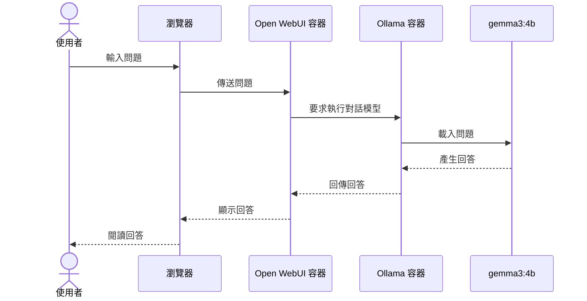
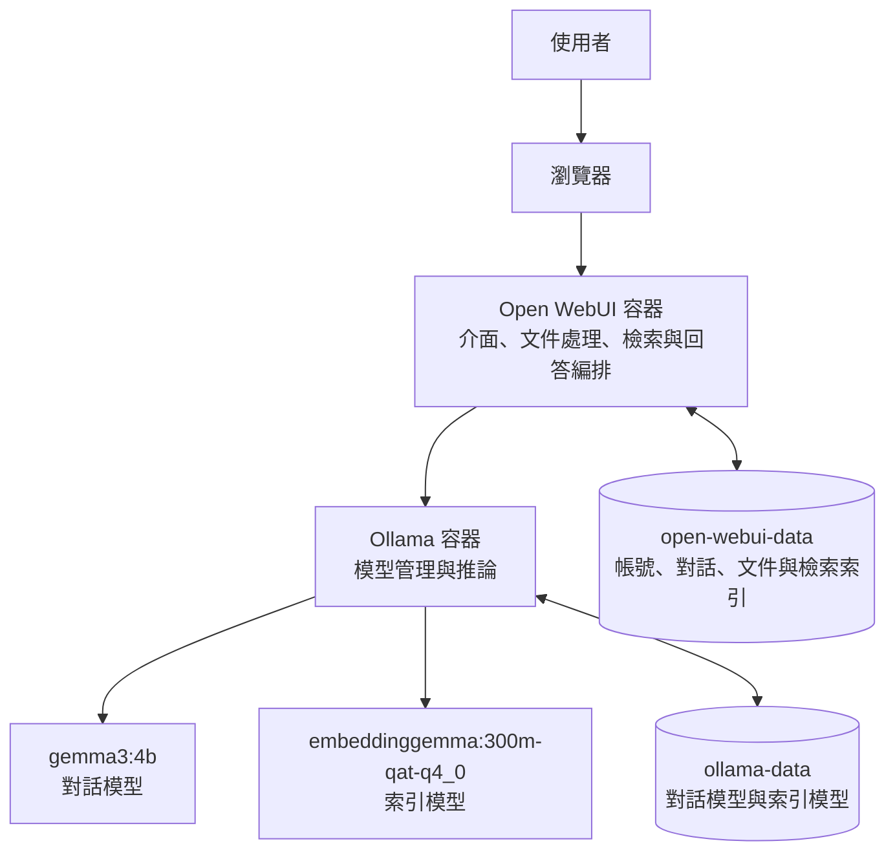
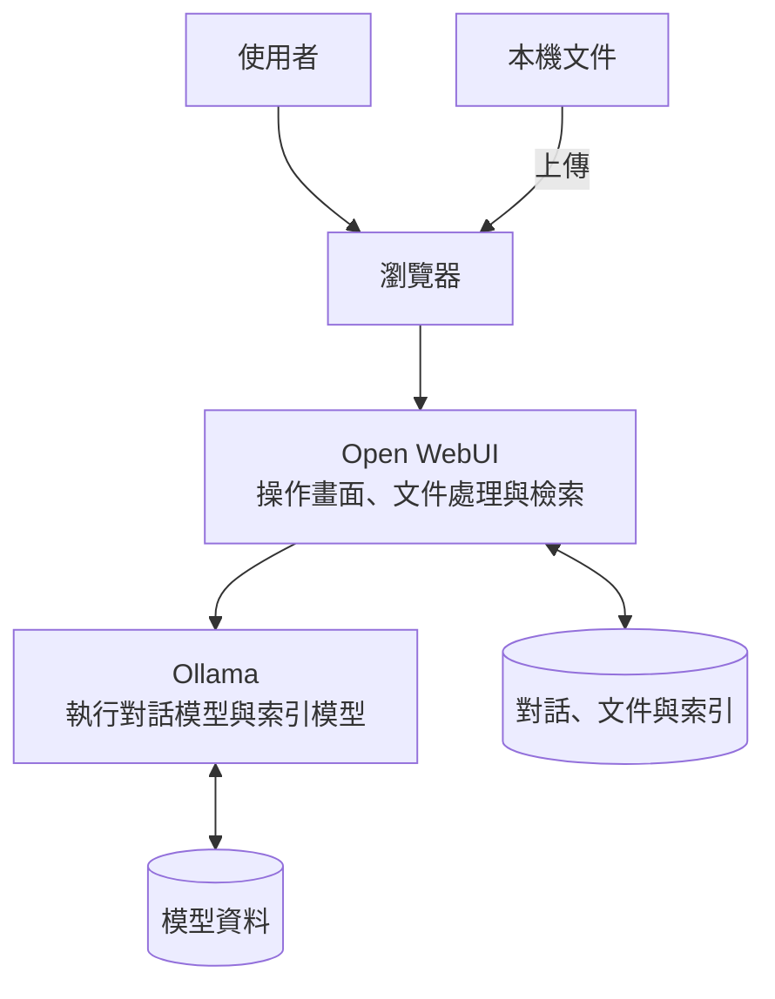
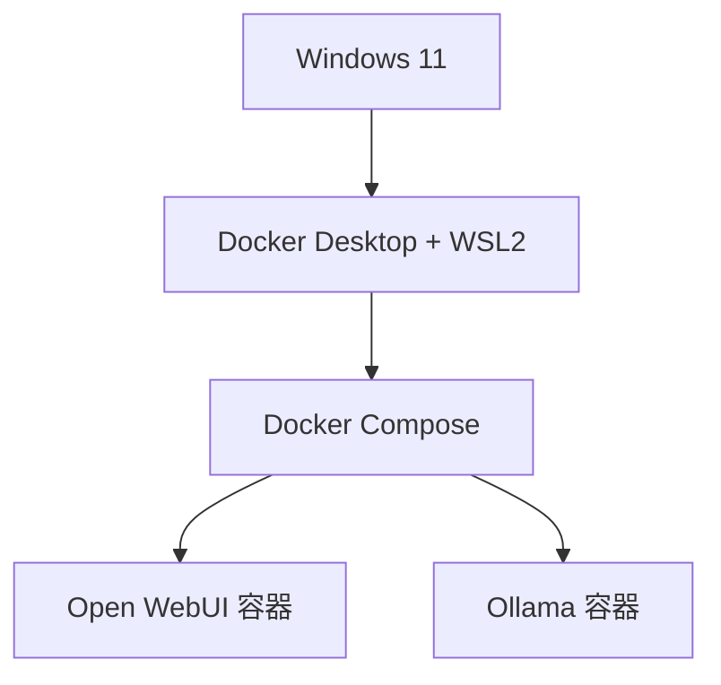
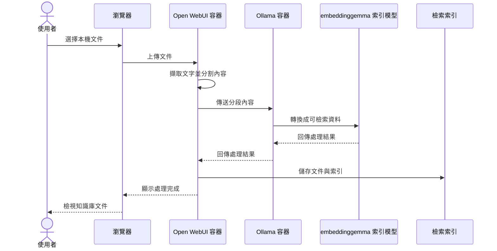
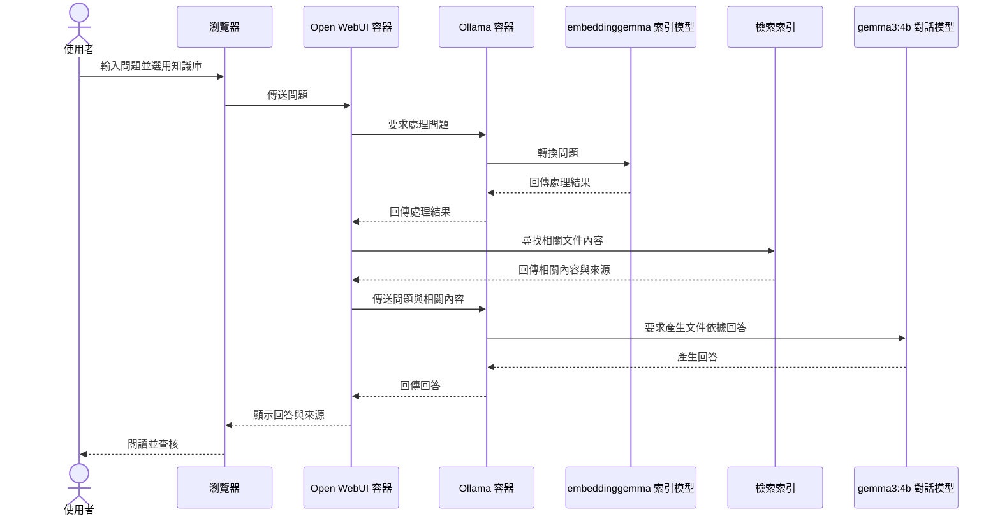

# 補充教材-本次實作架構演進

本文件供想了解第 04 單元至第 05 單元架構變化的學生與教師查閱，說明 Knowledge（知識庫）加入前後的元件、資料與問答流程

## 建立知識庫前

第 04 單元只有一般模型對話，使用者的問題經由 Open WebUI 傳送至 Ollama，再由 `gemma3:4b` 產生回答



此時模型主要依據原有能力與目前對話內容回答，尚未使用個人文件

## 建立知識庫後

第 05 單元沒有增加新容器，而是在原有的 Ollama 與 Open WebUI 中加入新的工作



| 項目 | 建立知識庫前 | 建立知識庫後 |
| --- | --- | --- |
| 容器數量（維持） | Ollama、Open WebUI | Ollama、Open WebUI |
| 模型角色 | `gemma3:4b` 負責回答 | `gemma3:4b` 仍負責回答，同時增加 `embeddinggemma:300m-qat-q4_0` 負責索引與檢索 |
| Open WebUI 工作 | 接收問題、儲存對話、顯示回答 | 增加文件擷取、內容分割、索引儲存與相關內容檢索 |
| Ollama 工作 | 執行對話模型 | 依工作執行對話模型或索引模型 |

## 元件互動關聯圖

### 操作與資料流向



### 軟體包含關係



- 使用者透過瀏覽器操作 Open WebUI
- 本機文件經由瀏覽器上傳至 Open WebUI
- Open WebUI 前端顯示畫面，後端負責文件與檢索
- Ollama 執行對話模型與索引模型
- Docker Compose 統一管理 Open WebUI 與 Ollama 兩個容器
- 對話、文件、索引與模型都儲存在各自的資料空間

## 文件匯入流程

文件上傳後，Open WebUI 先擷取文字並分割內容，再請 Ollama 使用索引模型處理各段內容，最後將結果儲存在 Open WebUI 的資料空間



原始文件與索引由 Open WebUI 管理，索引模型本身不儲存文件內容

## RAG 問答流程

下圖呈現 Open WebUI 先檢索文件內容，再交給對話模型的 Traditional RAG（傳統 RAG）流程

Traditional RAG、Agentic RAG 與 Knowledge 的關係，請參閱 [補充教材-Knowledge、RAG 與文件使用模式](補充教材-Knowledge、RAG-與文件使用模式.md)



## 設定檔的變化

`03_compose.yaml` 的服務數量沒有改變，只在 Open WebUI 增加兩項正式設定

```yaml
RAG_EMBEDDING_ENGINE: ollama
RAG_EMBEDDING_MODEL: embeddinggemma:300m-qat-q4_0
```

- `RAG_EMBEDDING_ENGINE` 指定由 Ollama 提供索引模型服務
- `RAG_EMBEDDING_MODEL` 指定建立索引與處理查詢時使用的模型
- 兩個名稱是 Open WebUI 規定的設定鍵，不能自行更名

## 資料儲存位置

| Docker volume | 儲存內容 |
| --- | --- |
| `ollama-data` | `gemma3:4b`、`embeddinggemma:300m-qat-q4_0` 與 Ollama 資料 |
| `open-webui-data` | 帳號、設定、對話、上傳文件、知識庫與檢索索引 |

> 停止容器不會刪除這些資料，刪除 Docker volume 才會移除其儲存內容

## 官方參考資料

- [Open WebUI Knowledge](https://docs.openwebui.com/features/workspace/knowledge/)
- [Open WebUI RAG](https://docs.openwebui.com/features/chat-conversations/rag/)
- [Open WebUI 環境變數與資料庫設定](https://docs.openwebui.com/reference/env-configuration/)
- [Open WebUI 備份與資料目錄](https://docs.openwebui.com/tutorials/maintenance/backups/)
- [Ollama Embeddings](https://docs.ollama.com/capabilities/embeddings)
- [Docker Desktop WSL2 後端](https://docs.docker.com/desktop/features/wsl/)

回到 [單元 05 說明文件](README.md)
