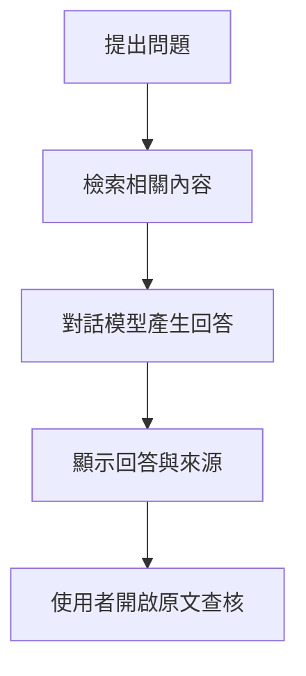

# 單元 06 文件問答與引用查核

## 1 教學目標

- 學生能在新對話中選擇指定的知識庫
- 學生能提出適合文件檢索的問題
- 學生能開啟來源並比對回答與原文
- 學生能辨認有文件支持、需要推論與資料不足的回答
- 學生能比較 Focused Retrieval 與 Full Context 的差異

## 2 必要觀念

### 回答附有來源不代表內容一定正確

RAG 回答需要經過檢索與生成，任何一個環節出現偏差都可能影響結果



- 系統可能找到不相關或不完整的內容
- 對話模型可能誤解、遺漏條件或做出超出原文的推論
- 來源標記只能指出系統參考了哪些內容，仍需由使用者確認來源是否真的支持回答

### 問題越明確越容易找到適合的內容

| 問題類型 | 提問方式 |
| --- | --- |
| 查找事實 | 根據知識庫，文件對某項內容有何說明 |
| 整理重點 | 根據知識庫，整理某個主題的三項重點 |
| 比較差異 | 比較指定文件對同一主題的相同與不同之處 |
| 尋找證據 | 列出支持或反對某項說法的文件內容 |
| 確認缺口 | 哪些問題無法由目前資料回答，還缺少哪些資料 |

避免只輸入「幫我分析」或「請整理」等缺少主題與範圍的問題

### 引用查核的重點

查核時應依序確認

1. 來源檔名是否與問題相關
2. 引用內容是否能在原始文件中找到
3. 原文是否直接支持回答中的主張
4. 回答是否遺漏前提、例外或限制
5. 其他文件是否提出不同或相反的說法

> 頁碼是否顯示取決於文件格式與文字擷取結果，沒有頁碼時仍應利用檔名、引用片段與原始文件內容進行比對

### Focused Retrieval 與 Full Context

| 模式 | 系統如何取得內容 | 適合情況 | 注意事項 |
| --- | --- | --- | --- |
| Focused Retrieval | 依問題找出部分相關內容 | 多份文件、較長文件與一般問答 | 可能遺漏沒有被檢索到的段落 |
| Full Context | 將完整文件內容提供給模型 | 單一且較短的文件 | 文件過長時會增加等待時間並排擠對話內容 |

Focused Retrieval 是本課程的主要 RAG 操作模式，Full Context 用於短文件的完整閱讀比較

Knowledge、File Context、Builtin Tools 與工具呼叫的完整關係，請參閱 [補充教材-Knowledge、RAG 與文件使用模式](../05-建立個人知識庫/補充教材-Knowledge、RAG-與文件使用模式.md)

需要使用固定文件與問題比較檢索、回答及引用品質時，請參閱 [補充教材-RAG 測試與評分](補充教材-RAG-測試與評分.md)

## 3 要點

- 來源標記代表系統曾參考該內容，不代表回答必然正確
- 查核回答時，應從回答主張回到引用片段與原始文件逐項比對
- 查核結果可分為直接支持、部分支持、不支持與資料不足
- 沒有檢索到證據時，可能是資料缺少、問題不明確或相關內容未被找出
- 不同文件的相同、相反與不足之處應分開保留，不急著合併成單一結論
- 使用相同問題比較 Focused Retrieval 與 Full Context，觀察兩種模式取得文件內容的差異

## 4 實作

### 步驟一 開啟知識庫對話

1. 啟動 Docker Desktop 並等待 Engine running
2. 在 `03_service-control.cmd` 上按兩下
3. 選擇 `1 Start Ollama and Open WebUI`
4. 開啟 [http://localhost:3000](http://localhost:3000)
5. 登入自己的本機帳號
6. 建立新對話並選擇 `gemma3:4b`
7. 在訊息輸入區輸入 `#`
8. 從清單選擇第 05 單元建立的知識庫
9. 選擇知識庫項目並確認使用 Focused Retrieval

> 若畫面使用不同語言，Focused Retrieval 可能顯示為 Using Focused Retrieval

### 步驟二 設定回答原則

先輸入下列內容
```text
本對話只根據已選擇的知識庫回答
每項重要結論都要附上來源
若資料不足，請直接說明資料不足與缺少的內容
若文件說法不同，請分別列出，不要自行合併成單一結論
不要使用知識庫以外的資訊補足答案
```
> 這些指示可以降低模型自行補充資料的機會，但不能取代來源查核

### 步驟三 進行單一主題問答

選擇一個自己已閱讀且知道答案的主題，輸入

```text
根據知識庫，請說明「［主題］」
列出三項重點，每項重點都要附上來源
```

將 `［主題］` 改成文件中實際出現的內容

### 步驟四 查核回答與來源

1. 找出回答中的三項主要主張
2. 開啟每項主張旁的來源標記
3. 記錄來源檔名與引用片段
4. 開啟本機原始文件並搜尋引用內容
5. 判定原文是否直接支持該項主張

使用下列表格記錄結果

| 回答主張 | 來源檔名 | 原文是否直接支持 | 查核結果 |
| --- | --- | --- | --- |
|  |  | 是／部分／否 |  |
|  |  | 是／部分／否 |  |
|  |  | 是／部分／否 |  |

若原文只能支持部分內容，應指出回答多說了什麼或遺漏了什麼

### 步驟五 測試資料不足

提出一個確定沒有收錄於知識庫的問題
```text
知識庫是否足以回答「［問題］」
若沒有直接證據，請回答資料不足並說明還需要哪些資料
```

確認回答沒有利用一般常識自行補足答案

### 步驟六 進行跨文件比較

選擇至少兩份談到相同主題的文件，輸入
```text
比較知識庫中各文件對「［主題］」的說法
請分成共同觀點、不同觀點與資料缺口
每項內容都要標示來源檔名
```

開啟來源並確認不同觀點確實來自不同文件

### 步驟七 比較兩種文件模式

1. 選擇一份內容較短且自己熟悉的文件
2. 建立新對話並以 Focused Retrieval 連結該文件或所在知識庫
3. 提出一個需要整合文件多個段落的問題
4. 記錄回答內容、來源與等待時間
5. 再建立一個新對話並連結相同內容
6. 選擇已連結的項目並切換為 Full Context
7. 輸入完全相同的問題
8. 比較兩次回答的完整度、來源與等待時間

> 若知識庫包含多份長文件，不要將整個知識庫切換為 Full Context，改用單一短文件進行比較

## 5 成功檢查

- 新對話已選擇 `gemma3:4b` 與指定知識庫
- 知識庫預設使用 Focused Retrieval
- 回答包含可開啟的來源標記
- 至少三項回答主張已與原始文件比對
- 能判定主張為直接支持、部分支持或不支持
- 資料不足測試沒有出現無來源的肯定答案
- 已完成一次跨文件比較
- 已使用同一問題比較 Focused Retrieval 與 Full Context

## 6 常見問題與排除

### 輸入 `#` 後找不到知識庫

確認已登入建立知識庫的帳號，再返回 [單元 05 建立個人知識庫](../05-建立個人知識庫/README.md) 檢查知識庫與文件是否仍然存在

### 回答沒有出現來源

確認知識庫已連結至目前對話且文件已完成處理，再將問題改得更明確並要求每項重要結論附上來源

### 回答內容與來源不一致

以原始文件為準，將不一致處記錄為不支持，再縮小問題範圍或指定文件重新提問

### 回答只引用其中一份文件

在問題中指定需要比較的文件或要求分別整理各文件觀點，仍未引用時先確認其他文件是否真的包含相關內容

### 來源沒有顯示頁碼

利用來源檔名與引用片段開啟原始文件搜尋，文件格式與文字擷取方式可能無法保留頁碼

### 使用 Full Context 後回答變慢或內容不完整

文件內容可能超出模型可處理的範圍，切換回 Focused Retrieval 或改用更短的單一文件

### 模型在資料不足時仍自行回答

建立新對話，重新輸入步驟二的回答原則，並在問題中再次要求沒有直接證據時回答資料不足

## 7 單元成果

學生完成一組文件問答、跨文件比較與資料不足測試，並留下引用查核紀錄，能依原始文件判斷回答是否可信

## 官方參考資料

- [Open WebUI Knowledge](https://docs.openwebui.com/features/workspace/knowledge/)
- [Open WebUI RAG](https://docs.openwebui.com/features/chat-conversations/rag/)
- [Open WebUI Chat Features](https://docs.openwebui.com/features/chat-conversations/chat-features/)

## 單元導引

- 上一單元：[單元 05 建立個人知識庫](../05-建立個人知識庫/README.md)
- 下一單元：[單元 07 資料更新與知識庫維護](../07-資料更新與知識庫維護/README.md)
