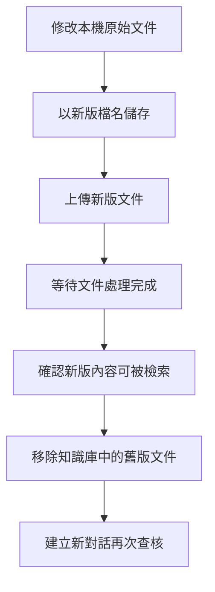

# 單元 07 資料更新與知識庫維護

## 1 教學目標

- 學生能判斷文件應新增、替換、重新命名或刪除
- 學生能以新版文件安全替換知識庫中的舊版文件
- 學生能確認新版內容已完成處理並可被檢索
- 學生能移除過期文件及其索引資料
- 學生能留下簡單的知識庫維護紀錄

## 2 必要觀念

### 本機文件與知識庫文件是兩份資料

本課程使用手動上傳方式，Open WebUI 會保存上傳當下的文件內容，不會持續監看 Windows 資料夾

在本機修改原始文件後，知識庫中的既有文件不會跟著改變，必須重新上傳新版文件



### 依文件變化選擇維護方式

| 文件情況 | 維護方式 |
| --- | --- |
| 新增不同內容的文件 | 直接上傳並等待處理完成 |
| 文件內容已修改 | 上傳新版、查核新版、移除舊版 |
| 只有檔名需要修正 | 重新命名即可 |
| 文件已過期或不再可信 | 從檔案管理移除 |
| 更換索引模型 | 更換後重新建立全部知識庫索引 |

> 同一內容若以不同檔名重複上傳，可能使搜尋結果同時引用多個版本，因此知識庫不應長期保留新舊兩版

### 重新建立索引不等於重新讀取文件

重新建立索引會利用上傳時已擷取的文字重新分割內容並建立索引，不會重新開啟電腦中的原始文件

- 本機文件內容已修改時，需要重新上傳
- 索引模型已更換時，需要重新建立既有知識庫索引
- 只有檔名需要調整時，不需要重新上傳或重新建立索引
- 文件無法被搜尋且服務狀態正常時，可將重新建立索引作為修復方式

### 使用新對話確認更新結果

既有對話可能保留先前回答與內容脈絡，容易使查核結果混入舊資料

完成文件更新或刪除後，應建立新對話並重新連結知識庫，再確認來源檔名與內容

### 檔名應能辨認版本

建議在檔名中保留日期或版本，例如

```text
課程規範_2026-09-14.pdf
設備手冊_v2.pdf
研究筆記_第3版.docx
```

不要只使用 `新版`、`最新版` 或 `最後版`，時間久了將難以判斷先後順序

## 3 要點

- 修改本機文件不會自動更新已上傳的知識庫文件
- 新增、替換、重新命名、刪除與重新建立索引各有不同用途
- 更新文件時先確認新版可用，再移除舊版
- 移除舊版後建立新對話，避免舊對話內容影響查核
- 使用版本化檔名與維護紀錄保留更新依據
- 文件來源、可信度或有效日期改變時，應重新判斷是否適合留在知識庫

## 4 實作

### 步驟一 盤點目前知識庫

1. 啟動 Docker Desktop 並等待 Engine running
2. 在 `03_service-control.cmd` 上按兩下
3. 選擇 `1 Start Ollama and Open WebUI`
4. 開啟 [http://localhost:3000](http://localhost:3000)
5. 登入自己的本機帳號
6. 從側邊欄開啟 "工作區（Workspace）"
7. 選擇 "知識庫（Knowledge）" 並進入單元 05 建立的知識庫
8. 記錄目前的文件名稱與版本

### 步驟二 準備新版文件

1. 在檔案總管找到單元 05 保留的 `設備借用與歸還規則_v1.md`
2. 複製檔案並將副本重新命名為 `設備借用與歸還規則_v2.md`
3. 在副本上按右鍵，選擇「開啟檔案」或「開啟檔案方式」，再使用記事本開啟
4. 將文件版本改為 `v2`
5. 將生效日期改為目前上課日期
6. 將歸還截止時間由 `16:30` 改為 `17:30`
7. 在文件版本資料下方加入更新識別碼

```text
更新識別碼：UPDATE-07
```

8. 在「歸還規定」加入下列內容

```text
借用人可在到期日中午 12:00 前申請一次展延，展延是否核准由管理單位確認。
```

9. 儲存新版文件並保留 v1，確認更新完成前不要刪除任何一版

### 步驟三 上傳新版文件

1. 返回原有知識庫
2. 選擇新增內容或上傳文件
3. 選取步驟二準備的新版文件
4. 等待上傳與處理完成
5. 確認畫面沒有顯示失敗或錯誤

此時新舊版本會暫時同時存在，完成新版查核後再移除舊版

### 步驟四 查核新版文件

1. 建立新對話並選擇 `phi4-mini:3.8b-q4_K_M`
2. 在訊息輸入區輸入 `#`
3. 只選擇剛上傳的新版文件
4. 點選訊息輸入區上方的文件名稱
5. 確認顯示「使用聚焦檢索（Using Focused Retrieval）」且開關位於關閉位置，再關閉視窗
6. 依序輸入下列問題

```text
這份文件的更新識別碼是什麼
請附上來源

設備最晚應在幾點歸還
請附上來源

借用人是否可以申請展延？有哪些條件
請附上來源
```

7. 確認回答包含 `UPDATE-07`、`17:30` 與展延條件
8. 開啟來源並確認檔名是 `設備借用與歸還規則_v2.md`

若無法找到更新內容，先不要刪除舊版文件，返回知識庫確認新版是否已完成處理

### 步驟五 移除舊版文件

1. 選擇左下角的帳號名稱或頭像
2. 開啟 "設定（Settings）"
3. 進入 "資料控制（Data Controls）"
4. 在 "管理檔案（Manage Files）" 選擇 "管理（Manage）"
5. 依檔名找到舊版文件
6. 再次核對新舊版本，確認選取的是舊版
7. 刪除舊版文件並確認操作
8. 返回 "工作區" 與 "知識庫"
9. 開啟原有知識庫，確認舊版已移除且新版仍然存在

> 從 "管理檔案" 刪除文件時，Open WebUI 會一併清除該文件在知識庫中的項目與索引資料，不會刪除 Windows 資料夾中的本機原始檔

### 步驟六 從知識庫再次查核

1. 建立另一個新對話並選擇 `phi4-mini:3.8b-q4_K_M`
2. 輸入 `#` 並選擇原有知識庫
3. 點選訊息輸入區上方的知識庫名稱
4. 確認顯示「使用聚焦檢索（Using Focused Retrieval）」且開關位於關閉位置，再關閉視窗
5. 再次詢問更新識別碼與歸還截止時間
6. 確認回答為 `UPDATE-07` 與 `17:30`
7. 確認來源只顯示 `設備借用與歸還規則_v2.md`

### 步驟七 建立維護紀錄

使用下列表格記錄本次更新

| 日期 | 知識庫 | 文件 | 動作 | 原因 | 查核結果 |
| --- | --- | --- | --- | --- | --- |
|  |  |  | 新增／替換／刪除／重新命名 |  |  |

維護紀錄可保存在本機資料夾，不需要上傳至知識庫

## 5 成功檢查

- 已辨認知識庫中的舊版與新版文件
- 新版文件已完成處理且可找到新增內容
- 回答來源顯示新版檔名
- 舊版文件已從檔案管理與知識庫移除
- 新對話連結知識庫後仍可取得新版內容
- 已完成一筆知識庫維護紀錄

## 6 常見問題與排除

### 修改本機文件後，回答仍是舊內容

知識庫不會跟著本機文件自動更新，請將修改後的文件另存為可辨識的新版檔名並重新上傳

### 上傳新版後同時引用新舊版本

確認新版內容與來源正確後，從 "設定" > "資料控制" > "管理檔案" 移除舊版，再建立新對話重新測試

### 刪除後仍在回答中看到舊內容

先確認來源是否仍指向舊版文件，若只有回答文字提到舊內容，可能來自目前對話的既有脈絡，請建立新對話並重新連結知識庫

### 新版文件已上傳但找不到新增內容

確認文件已完成處理、問題使用文件中的明確詞語且來源選擇正確，仍無法檢索時可由管理員設定中的 "文件（Documents）" 執行 "重新建立索引（Reindex）"

> "重新建立索引" 會處理全部知識庫文件並需要等待，本機文件內容改變時仍必須重新上傳，不能以此取代

### 誤刪仍需要的知識庫文件

從保留的本機原始檔重新上傳並等待處理完成，再建立新對話查核內容與來源

### 找不到 "管理檔案"

選擇左下角的帳號名稱或頭像，進入 "設定" > "資料控制"，再尋找 "管理檔案"

## 7 單元成果

學生完成一次知識庫文件更新、舊版清理與新版查核，並建立可供後續追蹤的維護紀錄

## 官方參考資料

- [Open WebUI Knowledge](https://docs.openwebui.com/features/workspace/knowledge/)
- [Open WebUI RAG](https://docs.openwebui.com/features/chat-conversations/rag/)
- [Open WebUI File Management](https://docs.openwebui.com/features/chat-conversations/data-controls/files/)

## 單元導引

- 上一單元：[單元 06 文件問答與引用查核](../06-文件問答與引用查核/README.md)
- 下一單元：[單元 08 備份、還原、停止與移除](../08-備份還原停止與移除/README.md)
